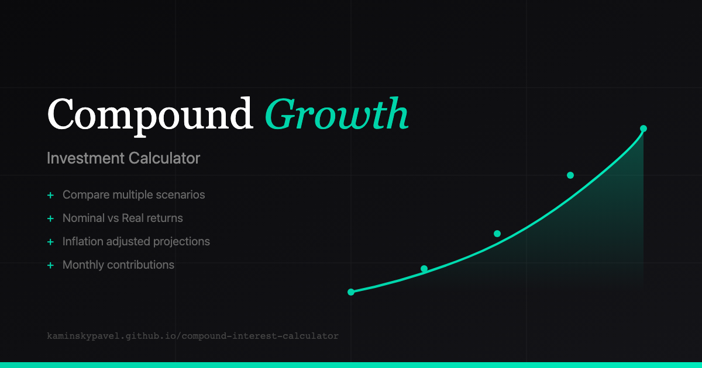

# Compound Growth Calculator

A modern, interactive investment calculator that visualizes compound interest growth over time. Compare multiple investment scenarios, see the impact of inflation on your returns, and make informed financial decisions.



**[Live Demo](https://kaminskypavel.github.io/compound-interest-calculator/)**

## Features

- **Multiple Scenarios** - Compare different investment strategies side by side
- **Nominal vs Real Returns** - See both raw returns and inflation-adjusted values using the [Fisher equation](https://en.wikipedia.org/wiki/Fisher_equation)
- **Monthly Contributions** - Model regular investment contributions alongside initial capital
- **Interactive Charts** - Zoom, pan, and explore your investment projections with Recharts
- **URL Serialization** - Share scenarios via URL - all parameters are stored in the query string
- **Multi-language Support** - English and Hebrew with full RTL support
- **Export to PNG** - Download your charts for presentations or records
- **Responsive Design** - Works beautifully on desktop and mobile devices

## Tech Stack

- **React 19** with TypeScript
- **Vite** for blazing fast development
- **Recharts** for interactive data visualization
- **Zustand** for state management
- **nuqs** for URL query state synchronization
- **Tailwind CSS v4** for styling
- **Bun** for package management and testing

## Getting Started

```bash
# Install dependencies
bun install

# Start development server
bun run dev

# Run tests
bun test

# Build for production
bun run build
```

## How It Works

### Compound Interest Formula

The calculator uses the future value formula with monthly compounding:

```
FV = P(1+r)^n + PMT × [((1+r)^n - 1) / r]
```

Where:

- **FV** = Future Value
- **P** = Initial Principal (Initial Investment)
- **r** = Monthly interest rate (Annual Return / 12)
- **n** = Number of months (Years × 12)
- **PMT** = Monthly contribution

### Real Returns (Fisher Equation)

To calculate inflation-adjusted (real) returns, we use the Fisher equation:

```
Real Rate = (1 + Nominal Rate) / (1 + Inflation Rate) - 1
```

This provides a more accurate adjustment for inflation than the simple approximation of subtracting the inflation rate from the nominal rate.

## Author

Developed by [Pavel "PK" Kaminsky](https://github.com/kaminskypavel)
